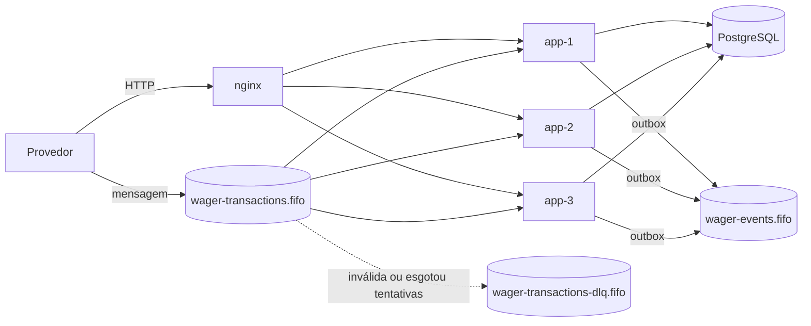
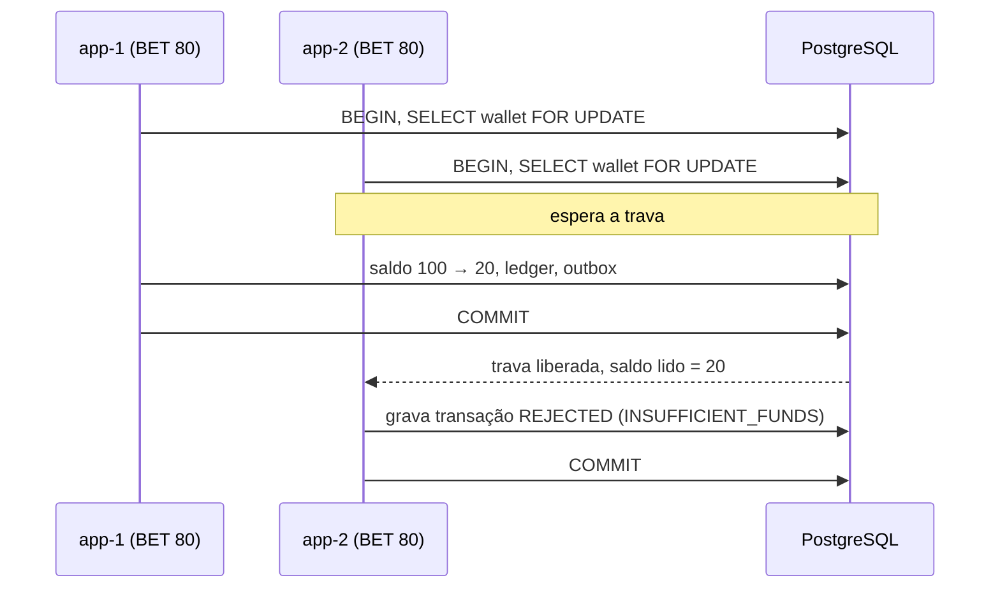
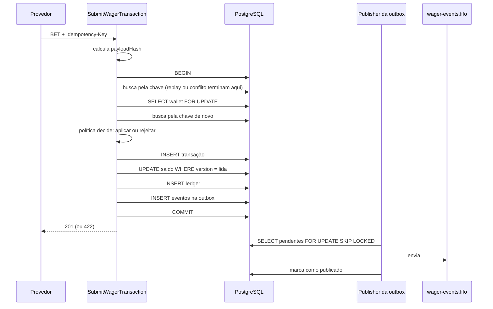
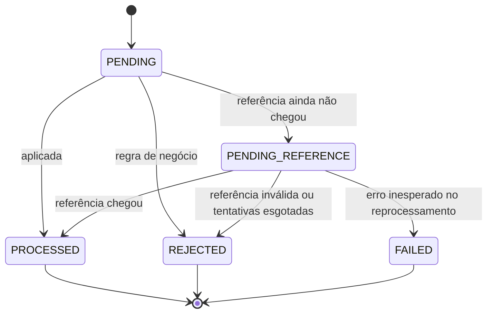

# Arquitetura

Este documento explica as decisões do projeto, o que foi descartado, o custo de cada escolha e as limitações conhecidas. Como rodar e exemplos de chamada estão no [README.md](README.md).

Formato das decisões: **decisão** · alternativa descartada · por quê · custo.

## Visão geral

O serviço recebe operações de aposta por HTTP e por SQS, decide se aplica ou rejeita, e grava transação, saldo, ledger e evento na mesma transação SQL. Três instâncias idênticas rodam ao mesmo tempo; o que as coordena é o PostgreSQL, não memória compartilhada.



Cada instância roda quatro coisas: servidor HTTP, consumidor SQS, publisher da outbox e resolver de referências pendentes.

Princípio que guia o resto: **o banco é o juiz**. Trava de linha, constraints e triggers garantem as invariantes. Fila FIFO, ordem de entrega e código da aplicação são otimizações em cima disso; se falharem, o resultado continua correto.

## Camadas

Arquitetura hexagonal. A dependência só aponta para dentro: `interface` e `infrastructure` → `application` → `domain`.

| Camada | Pasta | Conhece | Não conhece |
|---|---|---|---|
| Domínio | `src/domain/` | regras de negócio | banco, HTTP, NestJS, MikroORM |
| Aplicação | `src/application/` | casos de uso e portas (interfaces) | como banco e HTTP funcionam |
| Infraestrutura | `src/infrastructure/` | PostgreSQL, SQS, logs, métricas | regras de negócio |
| Interface | `src/interface/` | HTTP e workers | regras de negócio |

`src/composition/core.ts` é o único lugar que monta repositórios e casos de uso. O NestJS e os testes usam a mesma montagem.

- **Decisão:** hexagonal. **Descartado:** regra dentro de services do NestJS com entidades decoradas. **Por quê:** a regra financeira é testada sem banco e sem framework; trocar ORM ou transporte não toca nela. **Custo:** mais arquivos (portas, mapeadores) do que um CRUD direto.
- **Uma política por tipo de operação** (`BetPolicy`, `WinPolicy`, `LossPolicy`, `RefundPolicy`, `RollbackPolicy`). Um tipo novo é uma classe nova, não um `if` novo no caso de uso.
- **HTTP e SQS chamam o mesmo caso de uso** (`SubmitWagerTransaction`). Não há como os dois caminhos divergirem.

Desvio assumido: `interface` importa de `infrastructure` em dois pontos (contexto de log e nomes de fila). São utilitários sem regra de negócio; criar portas só para isso não se pagaria.

## ORM, Money e estratégia transacional

**ORM: MikroORM 6 com `EntitySchema`.**
Descartado: TypeORM/decorators nas classes de domínio; Prisma. Por quê: `EntitySchema` descreve o mapeamento fora da classe, então o domínio não importa nada do ORM; e o MikroORM dá acesso direto a `SELECT ... FOR UPDATE` e a SQL nativo quando preciso. Custo: mapeadores manuais entre registro e objeto de domínio (`mappers.ts`).

**Money: nunca `number`.**
`0.1 + 0.2` em ponto flutuante dá `0.30000000000000004`. O valor entra e sai como string decimal (`"25.00"`), vive como `Decimal` (`decimal.js`) dentro de `Money` (imutável, com moeda) e é gravado como `NUMERIC(20,2)`. O driver devolve `NUMERIC` como string, e ela vai direto para `Decimal`. A validação recusa número JSON e mais de duas casas. Operações entre moedas diferentes lançam erro.

**Transação: uma transação SQL por caso de uso, via `UnitOfWork`.**
Isolamento `READ COMMITTED` com trava de linha explícita. Descartado: `SERIALIZABLE` (exige retry em toda falha de serialização e não elimina a necessidade de idempotência). Tudo que pertence à operação (linha da transação, saldo, ledger, outbox e, no SQS, inbox) é gravado junto ou não é gravado.

**Migrations: SQL escrito à mão, com `up` e `down`.**
Constraints, índices parciais e triggers ficam visíveis e revisáveis, em vez de gerados a partir de metadados.

**Versões: NestJS 11, MikroORM 6, TypeScript 5.9.**
As versões principais mais novas mudaram a base; com três dias de prazo, usei as estáveis que conheço.

## Concorrência

Quatro defesas, em camadas. Cada uma cobre a falha da anterior.

| # | Defesa | O que garante |
|---|---|---|
| 1 | `SELECT ... FOR UPDATE` na linha da wallet | só uma operação por wallet por vez; wallets diferentes em paralelo |
| 2 | `lock_timeout` (3 s, `LOCK_TIMEOUT_MS`) | quem espera demais recebe 503 e reenvia com a mesma chave, em vez de segurar conexão |
| 3 | `UPDATE wallets ... WHERE version = <lida>` | se alguém alterou a wallet sem passar pela trava, a escrita é recusada |
| 4 | `CHECK (balance >= 0)`, `UNIQUE (wallet_id, wallet_version)` no ledger | o banco recusa saldo negativo e dois lançamentos para a mesma versão |

- **Decisão:** trava pessimista por wallet. **Descartado:** otimista com retry — numa wallet disputada vira tempestade de tentativas e a ordem deixa de ser previsível. **Descartado:** lock global ou advisory lock único — serializa todas as wallets (proibido pelo enunciado). **Descartado:** lock em memória ou Redis — não é atômico com a escrita no banco. **Custo:** operações da mesma wallet são serializadas; a vazão de uma wallet muito disputada é limitada pela duração da transação.
- **Ordem de trava fixa:** inbox (só SQS) → wallet → linha da transação. Mesma ordem em todo lugar evita deadlock.
- **Sem lógica "lê, calcula, grava" fora da trava:** o saldo usado na decisão é lido depois do `FOR UPDATE`.

O cenário do enunciado, com saldo 100 e duas apostas de 80 em instâncias diferentes:



Um débito só, saldo final 20. Provado em um processo (`test/integration`) e com três processos reais (`test/concurrency`).

## Idempotência e payloadHash

A idempotência é persistida no PostgreSQL: `UNIQUE (idempotency_key)` e `UNIQUE (provider_id, external_transaction_id)` em `wager_transactions`. Memória não serve: não é compartilhada entre instâncias e some no restart.

**Algoritmo do `payloadHash`** (`src/application/idempotency/payload-hash.ts`):

1. Seleciona explicitamente os campos de negócio: `providerId`, `externalTransactionId`, `playerId`, `walletId`, `roundId`, `gameId`, `kind`, `money`, `referenceExternalTransactionId`.
2. Normaliza o valor para duas casas (`"25"`, `"25.0"` e `"25.00"` viram `"25.00"`).
3. Serializa em JSON canônico: chaves ordenadas em todos os níveis, sem espaços, propriedades `undefined` descartadas.
4. SHA-256 em hexadecimal.

Campos fora dessa lista (correlation id, headers, ordem das chaves) não mudam o hash.

| Situação | Resultado |
|---|---|
| chave nova | processa |
| mesma chave, mesmo hash | replay: devolve o resultado gravado (HTTP 200) |
| mesma chave, hash diferente | `IDEMPOTENCY_KEY_CONFLICT` (HTTP 409) |
| chave nova, mas `(providerId, externalTransactionId)` já existe | `DUPLICATE_EXTERNAL_TRANSACTION` (HTTP 409) |

A busca pela chave acontece duas vezes: antes da trava (caminho rápido do replay) e depois dela (fecha a janela em que duas requisições iguais passam juntas pela primeira busca). Caso raro: a mesma chave em duas wallets diferentes ao mesmo tempo — as travas são diferentes, as duas passam, a constraint `UNIQUE` barra a segunda; o caso de uso roda de novo e cai em replay ou conflito.

Rejeição por regra de negócio também é gravada: reenviar uma aposta rejeitada devolve a mesma rejeição, não uma nova tentativa.

## Fluxo de uma BET



Se qualquer passo falha, nada fica gravado. O evento só é publicado depois do commit, e só pelo publisher.

## Estados da transação



`PENDING` é o estado de nascimento: a decisão é tomada antes do `INSERT`, então a linha já é gravada no estado decidido. `PROCESSED`, `REJECTED` e `FAILED` são terminais: o domínio recusa a transição e um trigger no banco recusa o `UPDATE`. Colunas de identidade (chave, provedor, wallet, valor, tipo) nunca mudam, e a linha não pode ser apagada.

## Regras de negócio e interpretações

| Tipo | Efeito no saldo | Referência |
|---|---|---|
| `BET` | débito | não tem |
| `WIN` | crédito | opcional; se informada, tem que ser uma `BET` |
| `LOSS` | nenhum (registro) | opcional; se informada, tem que ser uma `BET` |
| `REFUND` | crédito | obrigatória: uma `BET`, mesmo valor |
| `ROLLBACK` | inverso da operação referenciada | obrigatória: `BET`, `WIN` ou `REFUND`, mesmo valor |

A referência é buscada pelo mesmo `providerId` e precisa bater em wallet, jogador, moeda e rodada.

Interpretações próprias, onde o enunciado é ambíguo:

1. **Uma reversão efetiva por referência, de qualquer tipo.** O enunciado diz que a referência não pode ser revertida duas vezes "pelo mesmo tipo". Lido ao pé da letra, um `REFUND` e um `ROLLBACK` sobre a mesma `BET` creditariam o valor duas vezes. Aqui a segunda reversão é rejeitada com `REFERENCE_ALREADY_REVERSED`, e um índice único parcial (`wager_tx_single_reversal`) garante isso no banco.
2. `ROLLBACK` de um `REFUND` volta a debitar. A `BET` original não pode ser reembolsada de novo.
3. `WIN` sobre uma `BET` já revertida não é validado: pagar prêmio é decisão do provedor.
4. Operação para wallet inexistente não é persistida (a chave estrangeira não permitiria); responde 404.
5. `ROLLBACK` não reverte outro `ROLLBACK`.
6. Reversão que deixaria o saldo negativo (por exemplo, `ROLLBACK` de um `WIN` já gasto) é rejeitada com código próprio, `REVERSAL_INSUFFICIENT_FUNDS`, para o provedor distinguir de uma aposta sem saldo.

## Códigos de falha

Gravados na transação (`failureCode`), devolvidos com HTTP 422:

| Código | Quando | O que o provedor faz |
|---|---|---|
| `INSUFFICIENT_FUNDS` | `BET` maior que o saldo | desistir (decisão final para essa operação) |
| `REVERSAL_INSUFFICIENT_FUNDS` | reversão deixaria o saldo negativo | desistir; tratar manualmente |
| `CURRENCY_MISMATCH` | moeda da operação diferente da wallet | corrigir e enviar como nova operação |
| `PLAYER_WALLET_MISMATCH` | wallet não pertence ao jogador informado | corrigir e enviar como nova operação |
| `REFERENCE_NOT_FOUND` | referência não chegou dentro da janela de espera | desistir; verificar se a operação original foi enviada |
| `REFERENCE_NOT_PROCESSED` | a referência existe, mas foi rejeitada ou falhou | desistir |
| `REFERENCE_MISMATCH` | referência de outra wallet, jogador, moeda ou rodada | corrigir |
| `REFERENCE_AMOUNT_MISMATCH` | valor da reversão diferente do original | corrigir |
| `REFERENCE_KIND_NOT_ALLOWED` | tipo da referência não aceito por essa operação | corrigir |
| `REFERENCE_ALREADY_REVERSED` | a referência já foi revertida | desistir |
| `INTERNAL_ERROR` | erro inesperado ao reprocessar uma pendente (`FAILED`) | acionar suporte |

Uma rejeição é resultado final e idempotente: reenviar com a mesma chave devolve a mesma rejeição. "Corrigir" significa enviar outra operação, com outro `externalTransactionId`.

Só na resposta da API (nada é gravado):

| Código | Status | O que o provedor faz |
|---|---|---|
| `VALIDATION_ERROR` | 400 | corrigir o payload (a resposta lista os campos) |
| `IDEMPOTENCY_KEY_MISSING` | 400 | enviar o header `Idempotency-Key` |
| `UNAUTHENTICATED` | 401 | autenticar |
| `FORBIDDEN`, `PROVIDER_MISMATCH` | 403 | usar credencial com o papel e o provedor corretos |
| `WALLET_NOT_FOUND`, `TRANSACTION_NOT_FOUND` | 404 | corrigir o id |
| `WALLET_ALREADY_EXISTS` | 409 | usar a wallet existente |
| `IDEMPOTENCY_KEY_CONFLICT` | 409 | a chave já foi usada com outro conteúdo: não reenviar |
| `DUPLICATE_EXTERNAL_TRANSACTION` | 409 | o id externo já existe com outra chave: não reenviar |
| `SERVICE_UNAVAILABLE` | 503 | reenviar com a mesma chave, com espera crescente |
| `INTERNAL_ERROR` | 500 | reenviar com a mesma chave; se persistir, acionar suporte |

## Status HTTP

| Status | Significado |
|---|---|
| 201 | operação aplicada (`PROCESSED`) |
| 200 | replay idempotente, ou consulta |
| 202 | `PENDING_REFERENCE` |
| 400 | requisição inválida |
| 401 / 403 | identidade ausente / sem permissão |
| 404 | recurso não existe |
| 409 | conflito de idempotência ou de unicidade |
| 422 | rejeitada por regra de negócio (`REJECTED`, com `failureCode`) |
| 503 | falha passageira: banco fora, `lock_timeout`, conflito de versão |
| 500 | erro inesperado |

A separação que importa para o provedor: **4xx não adianta reenviar igual; 503 pode reenviar com a mesma chave**. O mapeamento fica numa única tabela (`problem-details.filter.ts`), e os erros saem em `application/problem+json` com `code` e `correlationId`. A mensagem de erro de validação aponta o campo e nunca repete o valor enviado.

## Referência fora de ordem

Um `REFUND` ou `ROLLBACK` pode chegar antes da `BET` que ele referencia. Em vez de rejeitar, a operação é gravada como `PENDING_REFERENCE` (HTTP 202) e um worker (`ResolvePendingReferences`) tenta de novo.

- Roda em todas as instâncias. Lista as pendentes vencidas sem trava e, para cada uma, abre uma transação: trava a wallet, trava a linha, **confere de novo se ainda está pendente e vencida**, e aplica a mesma política do fluxo principal. Sem essa conferência, três instâncias contariam a mesma tentativa três vezes.
- **Limite:** primeira tentativa após 5 s, depois o intervalo dobra até o teto de 300 s; 10 tentativas, cerca de 25 minutos no total (`REFERENCE_RETRY_POLICY`).
- **Por quê esse limite:** cobre atraso de entrega e reinício de um provedor, sem deixar dinheiro "pendurado" indefinidamente. Um TTL de segundos rejeitaria atrasos normais; um de horas esconderia operação perdida.
- **Esgotou:** `REJECTED` com `REFERENCE_NOT_FOUND` e evento `WagerTransactionRejected`.
- Conflito de concorrência no reprocessamento (versão da wallet mudou, unicidade) não é falha: registra um aviso e fica para o próximo ciclo. `FAILED` (com evento `WagerTransactionFailed`) fica reservado a erro inesperado.

## Mensageria

**Regra:** SQS FIFO é otimização; quem garante a corretude é o banco. Entrega duplicada ou fora de ordem não muda o resultado.

**Entrada (`wager-transactions.fifo`)**

- `MessageGroupId` = id da wallet: ordem dentro da wallet, paralelismo entre wallets.
- O corpo é validado com o mesmo schema do HTTP. Inválido → DLQ com motivo `INVALID_MESSAGE` (tentar de novo não conserta).
- **Inbox:** tabela `inbox_messages`, chave primária `(consumer_name, message_id)`. O `INSERT ... ON CONFLICT DO NOTHING` acontece **na mesma transação** da aposta. Se a aposta dá rollback, o registro some junto; nunca fica "marcada como feita" sem ter sido feita.
- **Ack depois do commit.** Se o processo cai entre o commit e o ack, a mensagem volta, a inbox reconhece e nada é aplicado de novo.
- **Retry:** falha passageira não apaga a mensagem; a invisibilidade cresce (2 s dobrando, teto de 300 s).
- **DLQ com motivo:** na 5ª tentativa o consumidor envia para a DLQ com `RETRIES_EXHAUSTED`. A fila tem um limite nativo de 15 recebimentos como rede de segurança, para o caso de o próprio consumidor estar quebrado. Os limites são diferentes de propósito: iguais, uma mensagem que só esperou atrás de outra iria para a DLQ sem nunca ter sido tentada.
- **Bloqueio de grupo:** se uma mensagem falha, as seguintes do mesmo grupo no lote não são processadas antes dela.

Inbox e `Idempotency-Key` protegem coisas diferentes: a inbox pega a mesma *mensagem* repetida; a chave pega a mesma *operação* repetida, venha por mensagens diferentes ou por HTTP.

**Saída (`wager-events.fifo`)**

- **Outbox:** o evento é gravado em `outbox_messages` na mesma transação da aposta. Publicar direto na fila teria dois modos de falha: publicar e o commit falhar (evento de algo que não aconteceu), ou commitar e cair antes de publicar (evento perdido).
- **Publisher:** `SELECT ... FOR UPDATE SKIP LOCKED` pega um lote de pendentes; as três instâncias publicam em paralelo sem esperar uma pela outra e sem pegar a mesma linha.
- **Entrega pelo menos uma vez.** Se o processo cai depois de enviar e antes de marcar, o evento sai de novo. O id do evento é o id de deduplicação da fila e o consumidor pode usá-lo para ignorar repetição. Perder evento financeiro é pior que repetir.
- Falha de envio: espera crescente (1 s dobrando, teto de 60 s), **sem limite de tentativas** — evento financeiro não se descarta.

**Envelope do evento** (classe abstrata `IntegrationEvent`, cada evento com `eventType` e `version` próprios):

```json
{
  "eventId": "…", "eventType": "WagerTransactionProcessed", "version": 1,
  "aggregateId": "<walletId>", "correlationId": "…", "causationId": "…",
  "occurredAt": "2026-10-02T12:00:00.000Z",
  "data": { }
}
```

Eventos: `WagerTransactionProcessed`, `WagerTransactionRejected`, `WagerTransactionPendingReference`, `WagerTransactionFailed`, `WalletBalanceChanged`.

**Shutdown gracioso:** no `SIGTERM`, os workers param primeiro (o consumidor termina o poll atual e devolve à fila o que não processou), depois o servidor HTTP fecha, por último banco e SQS. Nada fecha o banco com trabalho em andamento.

## Schema: o que o banco garante sozinho

Código tem bug e roda em várias cópias; o banco é um só e recusa o estado inválido.

| Tabela | Garantias |
|---|---|
| `wallets` | uma por jogador e moeda; `balance >= 0`; saldo não pode ser `NaN`; `version >= 1` |
| `wager_transactions` | chave de idempotência única; `(provider_id, external_transaction_id)` único; uma reversão efetiva por referência (índice único parcial); `failure_code` obrigatório quando rejeitada ou falha; linha terminal não muda, identidade nunca muda, linha não pode ser apagada (trigger) |
| `wallet_ledger_entries` | um lançamento por transação; um por versão da wallet; aritmética conferida (`balance_before ± amount = balance_after`); `UPDATE`, `DELETE` e `TRUNCATE` proibidos (triggers) |
| `inbox_messages` | a mesma mensagem não entra duas vezes por consumidor |
| `outbox_messages` | evento pendente sempre tem próxima tentativa |

O ledger é a fonte da verdade; o saldo em `wallets` é um resumo. `POST /wallets/:id/reconciliation` soma o ledger e compara com o saldo.

## Observabilidade

- **Logs:** uma linha JSON por evento (pino), com `correlationId`, `messageId` (SQS), `transactionId`, `walletId` e `providerId`. Não são logados valores monetários, payloads nem mensagens cruas do driver do banco.
- **Correlation id:** vem do header `X-Correlation-Id` ou do envelope da mensagem, ou é gerado. Fica num contexto (`AsyncLocalStorage`) que acompanha a execução, é gravado na transação e copiado para os eventos.
- **Métricas** (`/metrics`, Prometheus): `wager_transactions_total{status,kind,source}`, `wager_duplicates_total{source}`, `wager_idempotency_conflicts_total`, `wallet_lock_conflicts_total`, `wager_processing_duration_seconds`, `sqs_retries_total`, `sqs_dlq_messages_total`, `outbox_pending`, `outbox_lag_seconds`, `reconciliation_divergences_total`.
- **Instrumentação nunca altera resultado financeiro:** toda chamada de log e métrica passa por `safely()`, que engole erro. A aplicação só conhece as portas `Logger` e `Metrics`.
- **Health:** `/health/live` (processo vivo) e `/health/ready` (PostgreSQL e SQS respondem).

## Autenticação

O enunciado diz que autenticação não pontua. Por isso o padrão é **desligado** (`AUTH_MODE=noop`): o avaliador roda `docker compose up --build` e usa a API sem precisar de token. A autenticação real existe e é opcional (`AUTH_MODE=oidc`, ver README).

**Ponto de extensão**

- Porta `ProviderIdentityPort.identify(headers)` → `{ subject, roles, providerId? }`.
- `AuthGuard` global, **negação por padrão**: rota sem `@Roles(...)` nem `@Public()` é recusada.
- Papéis: `provider` (submete e consulta as próprias operações), `operator` (abre wallet, consulta, reconcilia), `auditor` (leitura e reconciliação).
- Regra que importa: identidade ligada a um provedor só age naquele provedor. Se o `providerId` do corpo ou da rota for outro: 403 `PROVIDER_MISMATCH`.

**Adaptadores**

| `AUTH_MODE` | Adaptador | Comportamento |
|---|---|---|
| `noop` (padrão) | `NoopIdentityAdapter` | concede todos os papéis, sem vínculo com provedor |
| `oidc` | `OidcIdentityAdapter` | valida o JWT do Keycloak |

**Como o modo `oidc` funciona**

- Fluxo `client_credentials` (serviço para serviço): cada provedor é um cliente no Keycloak.
- O token é validado localmente pela chave pública do emissor (JWKS), sem chamar o Keycloak a cada requisição. São conferidos assinatura, emissor, audiência (`wagering-api`) e validade.
- Papéis vêm de `realm_access.roles`; o provedor vem da claim `provider_id`, fixada no cliente dentro do Keycloak (o provedor não escolhe o próprio id).
- **Token inválido → 401. Chaves inalcançáveis → 503**, não 401 nem liberação: com o provedor de identidade fora do ar, recusar um chamador legítimo de forma definitiva ou deixar passar seriam respostas erradas. As chaves ficam em cache, então instâncias que já as carregaram continuam atendendo.
- Nada mudou em controllers nem em casos de uso: é um adaptador novo ligado à mesma porta.

- **Decisão:** validar JWT localmente por JWKS. **Descartado:** introspecção do token no Keycloak a cada requisição (uma chamada de rede por aposta e dependência dura da disponibilidade dele). **Custo:** um token revogado continua aceito até expirar (5 minutos no realm de desenvolvimento).

## Testes

| Nível | Pasta | O que prova |
|---|---|---|
| Unidade | `test/unit/` | regras de domínio, políticas, validação, adaptadores; sem infraestrutura |
| Integração | `test/integration/` | casos de uso, repositórios, schema, HTTP e mensageria com PostgreSQL e SQS reais; corridas em um processo |
| Regressão | `test/regression/` | um arquivo por bug encontrado; o teste falhou antes da correção |
| Concorrência | `test/concurrency/` | três processos reais no mesmo banco e nas mesmas filas |

- Nada de mock para banco ou fila nos testes de integração e concorrência.
- Todo teste de integração e de concorrência termina conferindo `saldo da wallet == soma do ledger`.
- Sem `sleep` fixo: os testes esperam uma condição, com tempo limite.
- Testes de queda usam um ponto de falha injetável (`CrashPoint`): o processo morre exatamente depois do commit e antes do ack, ou depois de publicar e antes de marcar.
- Corridas que dependem de um instante exato usam um "portão": o teste segura uma operação no meio e solta quando a outra chegou.

Limite honesto: os testes de três processos não distinguem `SKIP LOCKED` de um `FOR UPDATE` simples no publisher (só muda a vazão, não o resultado). Quem prova isso é um teste de integração com portão.

## Limitações conhecidas

- **Orçamento de retry compartilhado no grupo FIFO:** enquanto a primeira mensagem de uma wallet falha, as seguintes esperam e também contam recebimentos.
- **Ordem dos eventos de uma wallet pode variar entre retries e instâncias.** O evento `WalletBalanceChanged` leva `walletVersion` para o consumidor ordenar.
- **Deduplicação da fila de eventos vale 5 minutos** (janela do SQS FIFO). Reenvio depois disso só é reconhecido pelo consumidor, pelo `eventId`.
- **Uma wallet muito disputada é serializada** pela trava de linha; a vazão dela é limitada pela duração de uma transação.
- **`FAILED` no primeiro erro inesperado do resolver**, sem novas tentativas.
- **Pendentes que sempre dão conflito ficam na frente da listagem do resolver.**
- **`SQS_ENDPOINT` definido força credenciais fictícias** (pensado para o LocalStack).
- **nginx resolve as instâncias só na subida;** instância recriada com outro IP exige reiniciar o nginx.
- **Métricas são por instância** e não passam pelo balanceador; faltaria um Prometheus coletando cada uma.
- **`outbox_pending` e `outbox_lag_seconds` são medidos por instância** sobre a mesma tabela (o valor é global, repetido em cada uma).
- **`interface` importa `infrastructure` em dois pontos** (contexto de log, nomes de fila).
- **Um banco só:** sem réplica nem particionamento. A escala horizontal é das instâncias da aplicação.
- **Sem limpeza de `inbox_messages` e de eventos já publicados;** crescem indefinidamente.
- **Autenticação desligada por padrão;** token revogado vale até expirar (validação local por JWKS).
- **Um 503 de todas as instâncias é devolvido como 503**, mas o nginx não distingue instância caída de instância ocupada (`max_fails=0`): instância morta só sai da rotação por erro de conexão a cada requisição.

## O que faria com mais tempo

- Rotação e gestão de segredos dos clientes; o realm versionado é só para desenvolvimento.
- Aumentar a vazão do publisher da outbox (o teste de carga em [docs/LOAD_TEST.md](docs/LOAD_TEST.md) mostrou acúmulo sob pico).
- Rotina de retenção para inbox e outbox.
- Orçamento de tentativas e fila de inspeção para transações `FAILED`.
- Coleta central de métricas e alerta sobre `outbox_lag_seconds` e `reconciliation_divergences_total`.
- Reconciliação periódica de todas as wallets, em vez de só sob demanda.
